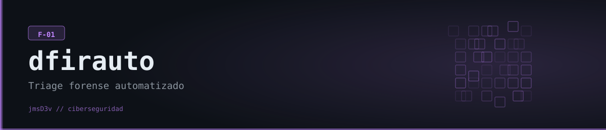

# DFIR-Auto



**Triaje forense automatizado de un sistema en vivo (F-01) — procesos, red, filesystem y persistencia, con narrativa de incidente generada por IA.**

## Qué hace

DFIR-Auto es una CLI en Python que ejecuta cuatro (opcionalmente cinco) recolectores de evidencia forense en paralelo sobre el sistema donde corre — procesos (`psutil`), conexiones de red (`psutil`), archivos sospechosos en directorios temporales, y mecanismos de persistencia (Run keys de registro en Windows, cron/rc.local en Linux, LaunchAgents en macOS). Opcionalmente suma un quinto recolector que parsea archivos `.evtx` (Visor de Eventos de Windows) en busca de logones fallidos, creación de cuentas, servicios nuevos y borrado de logs. Todos los hallazgos se normalizan a un `ForensicArtifact` con severidad, técnica MITRE ATT&CK asociada y timestamp, se ordenan en una línea de tiempo unificada, y —si hay una API key de Gemini configurada— se le pide a la IA que redacte una reconstrucción del incidente, una evaluación de amenaza y recomendaciones de contención. Sin la key, el triaje se ejecuta igual y simplemente no incluye esa sección (no rompe).

Es una herramienta de **triaje**, no de forense profundo: usa heurísticas relativamente simples (rutas sospechosas, puertos clásicos de backdoor, nombres de proceso, patrones de texto) pensadas para señalar rápido dónde mirar, no para dar un veredicto definitivo.

## Características

- 4 recolectores corriendo concurrentemente vía `asyncio.gather` (proceso, red, filesystem, persistencia) + un 5to opcional (EVTX) si se pasa `--evtx`.
- Multiplataforma: cada recolector se auto-filtra según `sys.platform` (Windows es la plataforma principal, pero corre en Linux/macOS).
- Clasificación de severidad (CRITICAL/HIGH/MEDIUM/LOW/INFO) y mapeo a técnicas MITRE ATT&CK por cada hallazgo (ej. `T1036.005` process masquerading, `T1547.001` autorun registry, `T1070.001` borrado de logs).
- Detecciones concretas: procesos enmascarados como binarios del sistema en rutas incorrectas, procesos sin imagen en disco (indicio de hollowing), conexiones salientes a puertos clásicos de C2 (4444, 1337, 31337...), archivos con doble extensión (`factura.pdf.exe`), firmas de webshell en PHP/ASP, binarios SUID/SGID en Linux, entradas de autorun en el registro de Windows.
- Reporte HTML con tema oscuro (Jinja2) y exportación JSON para cadena de custodia.
- Narrativa de incidente por IA — resume qué pasó, evalúa severidad global y sugiere remediación. **No depende de un proveedor fijo**: detecta automáticamente cuál API key está configurada (Anthropic Claude, Google Gemini u OpenAI) y usa esa. Se puede desactivar con `--no-ai` y la app funciona igual.
- **Heurísticas simples = falsos positivos esperables.** Verificado en una corrida real: `cmd.exe` se marca HIGH porque su nombre está en la lista de "herramientas de red" (`_NETWORK_TOOLS`), y `System`/`System Idle Process` (PID 0/4 en Windows) se marcan HIGH por "sin ejecutable en disco" — son procesos del kernel, no hay nada raro. Toda entrada de autorun en el registro se clasifica como mínimo MEDIUM aunque sea legítima. Es una herramienta de triaje rápido para priorizar revisión manual, no un veredicto final.

## Requisitos

- Python 3.11+ (probado en este entorno con 3.14.6).
- Sin dependencias de sistema — todas las librerías (incluidas `cryptography` y `grpcio`, que traen extensiones nativas) instalan como wheels precompiladas en Windows/Linux/macOS, no hace falta compilador.
- Variable de entorno opcional — **cualquiera de estas API keys** habilita la narrativa de incidente con IA (se detecta automáticamente cuál está configurada; sin ninguna, todo lo demás funciona igual):
  - `ANTHROPIC_API_KEY` (Claude) — prioridad más alta si hay varias configuradas.
  - `GEMINI_API_KEY` (Google Gemini, tiene tier gratuito) — segunda prioridad.
  - `OPENAI_API_KEY` (OpenAI) — tercera prioridad.

## Instalación

```bash
git clone https://github.com/jmsD3v/dfirauto
cd dfirauto

python -m venv .venv
source .venv/Scripts/activate      # Windows (Git Bash) — en cmd/PowerShell: .venv\Scripts\activate
pip install -e .

cp .env.example .env
# Opcional: agregar UNA de ANTHROPIC_API_KEY / GEMINI_API_KEY / OPENAI_API_KEY en .env
```

Instalación verificada en este entorno (Windows, Python 3.14.6, venv limpio): `pip install -e .` resuelve las dependencias (incluyendo los SDKs `anthropic`, `google-generativeai` y `openai`) sin conflictos ni errores.

## Uso

```bash
# Triaje completo del sistema actual, sin IA, guardando JSON
dfirauto triage --no-ai --output triage.json

# Triaje completo con narrativa de IA (requiere ANTHROPIC_API_KEY, GEMINI_API_KEY u OPENAI_API_KEY)
dfirauto triage --output triage.json

# Triaje incluyendo análisis de un .evtx puntual
dfirauto triage --evtx C:\Windows\System32\winevt\Logs\Security.evtx --no-ai

# Correr un solo recolector
dfirauto collect process
dfirauto collect network
dfirauto collect filesystem
dfirauto collect persistence
dfirauto collect evtx --evtx Security.evtx

# Generar reporte HTML a partir de un JSON ya guardado
dfirauto report triage.json --output report.html

# Demo rápida (triaje completo sin EVTX)
dfirauto demo --no-ai
```

Comando ejecutado de verdad en esta máquina durante la verificación:

```bash
$ dfirauto triage --no-ai --output triage.json
Triage complete: 0 critical  3 high  16 medium  19 total artifacts  (8.2s)
```

(19 artefactos: procesos del sistema marcados por heurística, conexiones activas de Chrome, y las Run keys del registro — todo benigno en este equipo, tal como se espera de una triaje de rutina).

## Estructura del proyecto

```
dfirauto/
├── dfirauto/
│   ├── collectors/
│   │   ├── base.py                  # BaseCollector (ABC) + chequeo de plataforma soportada
│   │   ├── process_collector.py     # Enumeración de procesos vía psutil
│   │   ├── network_collector.py     # Conexiones activas vía psutil
│   │   ├── filesystem_collector.py  # Archivos sospechosos en directorios temporales
│   │   ├── persistence_collector.py # Registro (Win) / cron+rc.local (Linux) / launchd (macOS)
│   │   └── evtx_collector.py        # Parseo de .evtx con python-evtx
│   ├── core/triage.py               # Orquestador: corre los collectors en paralelo y arma la timeline
│   ├── analyzers/ai_analyzer.py     # Narrativa de incidente — auto-detecta proveedor (Claude/Gemini/OpenAI)
│   ├── types/artifacts.py           # ForensicArtifact, TriageReport, TimelineEvent, Severity
│   ├── report/generator.py + template.html  # Reporte HTML (Jinja2) y PDF (weasyprint, opcional)
│   └── cli/main.py                  # CLI (Typer): triage / collect / report / demo
├── .env.example
└── pyproject.toml
```

## Aviso legal

Herramienta desarrollada con fines educativos y de portfolio. Pensada para uso autorizado sobre sistemas propios o con consentimiento explícito del propietario — ejecutarla contra un sistema de terceros sin autorización puede constituir un delito. El autor no se hace responsable del uso indebido de esta herramienta.
